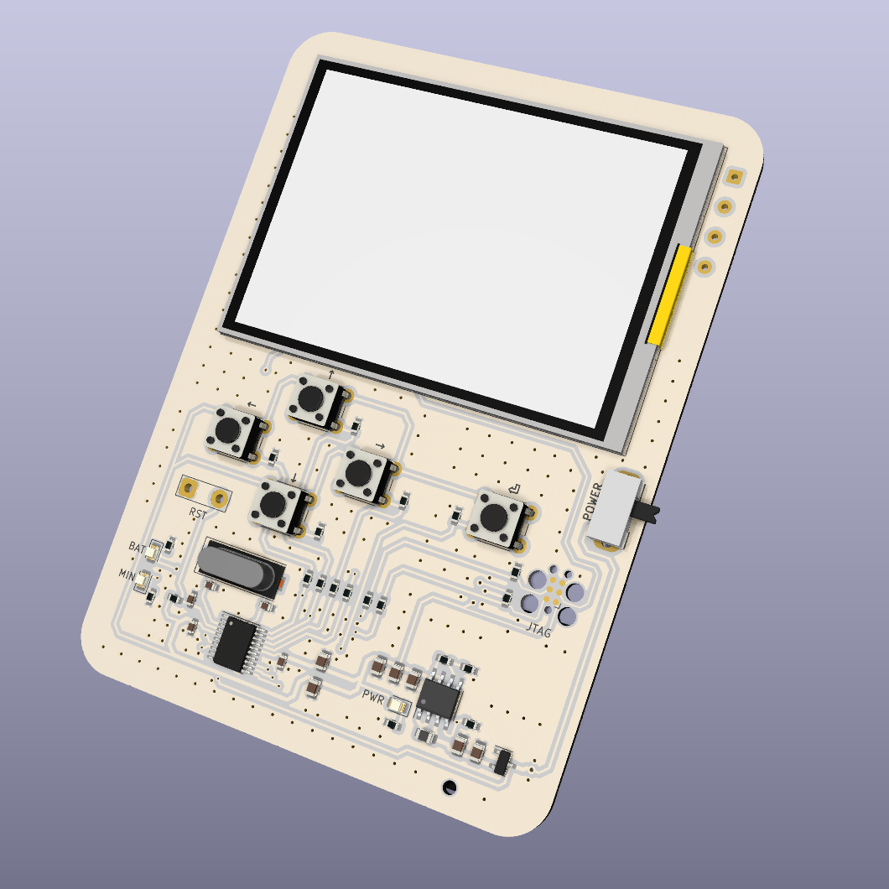
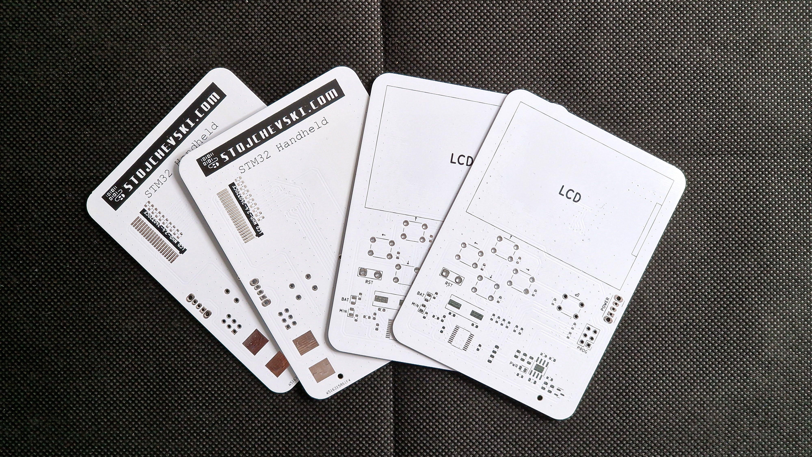
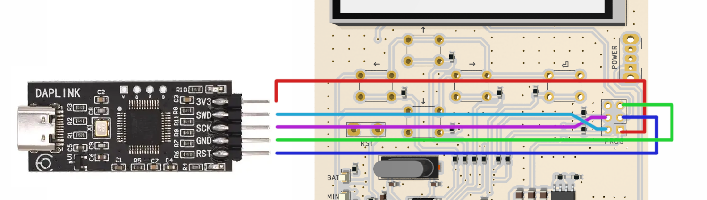

# STM32 Pocket Game/Dev Console 🕹️

The STM32 Pocket Game/Dev Console is a handheld device powered by 2xAAA batteries. This compact console features 5 programmable buttons, 2 LEDs, and an SPI TFT 2.4" display with a resolution of 320x240 pixels.

Originally equipped with a TagConnect connector for programming, the board underwent a redesign, now featuring a basic 2.54mm pitch connector for enhanced programming flexibility.

Measuring only 97x70mm, this board is designed to be easily customized for various purposes according to your specific needs.

## Key Features:

- Powered by 2xAAA batteries for portability.
- 5 programmable input buttons for versatile interaction.
- 2 LEDs for status indication.
- Battery voltage monitoring through analog readings.
- 2.4" SPI TFT display with a resolution of 320x240 pixels.
- 2.54mm pitch connector for programming convenience.

## Manufacturing:

PCBWay generously sponsored the production of this board, providing top-notch PCB manufacturing services. The boards were carefully packaged and demonstrated excellent quality. I was delighted to receive them at my destination within just a week of placing the order.

Beyond their exceptional manufacturing capabilities, PCBWay offers additional services such as PCB assembly, 3D printing, and CNC machining. These services empower you to transform your project into a comprehensive, ready-to-use product that can be easily sold or instantly put into use.

If you're interested in building this device, you can find the manufacturing files in the `/gerbers` folder. Head to [PCBWay](https://www.pcbway.com/) to get your boards manufactured.

## Programming:

This board is compatible with various STM32 programmers, including ST-Link and J-Link. I used a cheaper programmer called DAPLINK from AliExpress, as shown in the image below, for the actual programming. Make sure to check the schematics to match the exposed SWD interface with your programmer.

## Customization:

The compact size of 97x70mm allows for easy customization, making it adaptable to different use cases based on your requirements.

Feel free to explore the possibilities and unleash the potential of the STM32 Pocket Game/Dev Console for your unique projects!

### Ongoing Development

This project is still a work in progress as the software has not been officially completed, and additional tests are pending to ensure the stability and performance of the device. Stay tuned for updates, or feel free to build one yourself if you enjoy experimenting.
